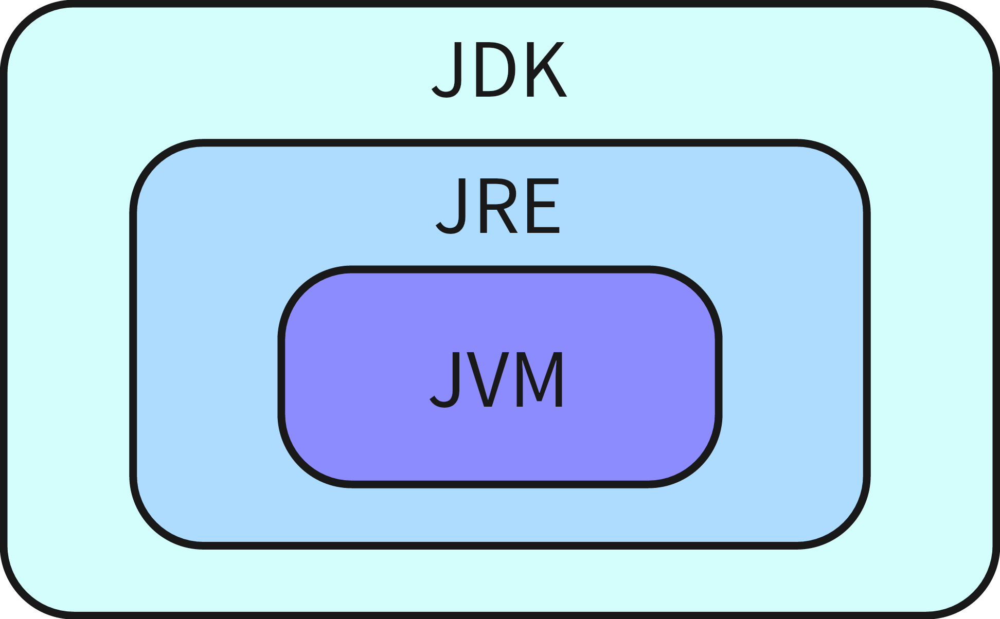
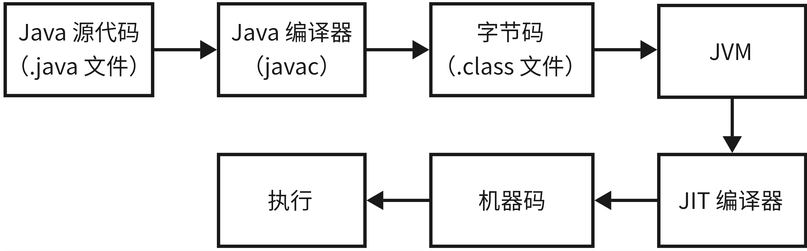

# Java 基础

## Java 的优势或特点

可以从**跨平台、垃圾回收、生态**三个方面进行阐述。

### 跨平台

首先，Java 是跨平台的，不同平台执行的机器码是不同的，但 Java 运入了 JVM 这一中间层，使得 Java 程序可以做到一次编写，多次运行，即"Write once, Run anywhere"。

Java 程序的编译和执行过程如下：Java 源代码首先被编译成字节码，然后由 JVM 解释或者通过 JIT（即时编译器）编译成机器码执行。由于 JIT 编译需要预热，Java 还提供了 AOT（提前编译），可以直接将字节码转换为机器码。

实际上，跨平台已经不再是 Java 语言的最大卖点，现代虚拟化技术如 Docker 也能实现跨平台运行，但 Java 的跨平台能力依然非常成熟和可靠。

### 垃圾回收

Java 提供了自动垃圾回收（GC）功能，简化了内存管理，手动管理内存虽然可以更加自由和精细，但也容易出错，容易导致内存泄漏和悬空指针等问题。

在内存充裕的情况下，将内存管理交给 GC，可以减轻开发者的负担，提升开发效率和代码可靠性。GC 可以自动回收不再使用的对象内存，使开发者专注于业务逻辑的实现。

### 生态

* **Spring 系列**：提供全面的企业级应用开发解决方案，涵盖了从依赖注入到企业集成的广泛需求。
* **Apache 系列**：如 Apache Hadoop、Apache Kafka 等，广泛用于大数据处理和分布式系统。
* **Maven 和 Gradle**：项目管理和构建工具，简化了项目依赖管理和构建过程。
* **Mybatis**：灵活的持久层框架，简化数据库操作，使得 SQL 查询更加直观和易于维护。
* **Hutool**：一个功能强大的 Java 工具类库，包含众多常用工具，大大提高开发效率。

### 其他特点

* **简单**：Java 语法相对简洁，学习曲线较平缓，适合初学者。
* **面向对象**：支持面向对象编程，提供封装、继承、多态等特性，有助于构建模块化和可维护的代码。
* **多线程**：原生支持多线程编程，便于开发高并发应用。
* **安全性**：内置安全机制，如字节码验证、沙箱模型等，确保程序运行时的安全性。

---

## 聊聊 Java SE、Java EE、Java ME 的区别

### Java SE（Java Platform, Standard Edition）

Java 标准版，是 Java 编程语言的基础。它包含支持 Java 应用程序开发和运行的核心类库、虚拟机（JVM）等核心组件。Java SE 可用于构建桌面应用或简单的服务器应用程序。

### Java EE（Java Platform, Enterprise Edition）

Java 企业版，曾被称为 J2EE，建立在 Java SE 的基础上，包含支持企业级应用程序开发和部署的标准和规范，如 Servlet、JSP、EJB、JDBC、JPA、JTA、JavaMail、JMS 等。Java EE 可用于构建分布式、可移植、健壮、可伸缩和安全的服务端 Java 应用程序，例如 SOA / Web 应用程序。

### Java ME（Java Platform, Micro Edition）

Java 微型版，曾被称为 J2ME，也基于 Java SE。它是一套专为嵌入式设备设计的 API 接口规范，主要用于开发移动设备和嵌入式设备软件，如手机游戏、PDA、电视机顶盒和打印机相关的嵌入式设备软件。现在已很少使用。

### 总结

* **JAVA SE** 是基础，提供了核心库和语言特性。
* **Java EE** 扩展了 Java SE，针对企业级应用开发提供了更多功能和组件。
* **Java ME** 专注于嵌入式设备和移动设备的应用开发，提供轻量级的运行时环境和 API。

---

## 聊聊 JDK、JRE、JVM 的区别

### JDK（Java Development Kit）

JDK 是功能齐全的 Java 开发套件，为开发者提供创建和编译 Java 程序所需的工具和环境。它包含了 JRE，以及用于开发、调试和监控 Java 应用程序的工具，例如：

* `javac`：编译器，用于将 Java 源代码编译成字节码。
* `java`：运行时工具，用于执行 Java 程序。
* `javadoc`：文档生成器，用于生成 API 文档。
* `jar`：打包工具，用于创建和管理 JAR 文件。
* `jdb`：调试器，用于调试 Java 程序。
* `jps`、`jstat`、`jmap`、`jhat`、`jconsole`：监控和分析工具，用于监控和调试 Java 应用程序的性能。

### JRE（Java Runtime Environment）

JRE 是 Java 运行时环境，包含了 JVM 和 Java 基础类库。JRE 提供了运行 Java 程序所需的核心组件，但不包含开发工具。

### JVM（Java Virtual Machine）

JVM 是运行 Java 字节码的虚拟机。JVM 通过针对不同操作系统的特定实现，使得相同的字节码在不同系统上都能得到相同的运行结果。JVM 是 Java 语言“一次编译，随处运行”的关键所在。

需要注意的是，JVM 并不是只有一种，只要满足 JVM 规范，各家公司都可以开发自己的 JVM 实现。例如：

* **HotSpot VM**：Oracle 提供的标准 JVM 实现，广泛使用。

* **J9 VM**：IBM 提供的 JVM 实现，注重性能和可扩展性。

* **Zing VM**：Azul 提供的 JVM 实现，优化了垃圾回收和低延迟应用。

* **JRockit VM**：Oracle 之前收购 BEA Systems 后提供的 JVM 实现，已整合到 HotSpot VM 中。



---

## 什么是字节码？

在 Java 中，字节码是 JVM 可以理解的代码，即后缀为 `.class` 的文件。它不面向任何特定的处理器，只面向 JVM 虚拟机。

## 为什么采用字节码？

Java 语言采用字节码的方式，主要是为了解决以下两个问题：

1. **执行效率**：字节码比传统的解释性语言运行效率更高。通过将源代码编译成字节码，Java 程序在运行时可以被 JVM 快速解释和执行，同时还能通过 JIT（即时编译器）进一步提升性能。
2. **可移植性**：字节码不针对任何特定的机器，而是针对 JVM 虚拟机。这使得 Java 程序可以在不同的操作系统和硬件平台上运行而无需重新编译，实现了"Write once, Run anywhere"的目标。

---

## Java 程序从源码到运行的过程



首先，开发者使用文本编辑器或集成开发环境（IDE）编写 Java 源代码文件，文件以 `.java` 为后缀。编写完成后，使用 `javac` 编译器将 Java 源代码编译成字节码，生成 `.class` 文件。这些字节码文件是平台无关的，可以在任何实现了 Java 虚拟机（JVM）的平台上运行。

接下来，JVM 读取并解释字节码，或者使用即时编译器（JIT）将字节码转换为机器码。JIT 编译器在程序运行时，通过监控程序的执行情况，识别出“热点代码”——即那些被频繁执行的代码片段。JIT 编译器会将这些热点代码编译成机器码，从而减少解释执行的开销。这个过程称为即时编译，因为它在程序运行时动态地进行编译。

JIT 编译的一个关键优势在于它能够利用运行时的实际信息进行优化。例如，它可以通过内联方法调用、优化循环等技术，生成更加高效的机器码。此外，JIT 编译器可以持续监控程序的运行，并根据需要重新编译代码以进一步优化性能。

通过 JIT 编译器生成的机器码可以直接由计算机的处理器执行，提供接近原生应用的性能。最终，生成的机器码在目标平台上执行，完成 Java 程序的功能。

---

## 基本数据类型有哪些？

| 基本类型 | 包装类型  | 位数 | 字节数 |  默认值  |         取值范围         |
| :------: | :-------: | :--: | :----: | :------: | :----------------------: |
|   byte   |   Byte    |  8   |   1    |    0     |        -128 ~ 127        |
|  short   |   Short   |  16  |   2    |    0     |      -32768 ~ 32767      |
|   int    |  Integer  |  32  |   4    |    0     | -2147483648 ~ 2147483647 |
|   long   |   Long    |  64  |   8    |    0L    |     -2^63 ~ 2^63 - 1     |
|  float   |   Float   |  32  |   4    |   0.0f   |  约为 1.4E-45 ~ 3.4E38   |
|  double  |  Double   |  64  |   8    |   0.0d   | 约为 4.9E-324 ~ 1.7E308  |
| boolean  |  Boolean  |  1   |   1    |  false   |       true、false        |
|   char   | Character |  16  |   2    | '/u0000' |        0 ~ 65535         |

> **注意**：在 Java 中，`boolean` 类型的变量理论上只需要 1 位来表示（`true` 或 `false`），但在实际实现中，JVM 通常使用 1 个字节（8 位）来存储一个 `boolean` 值。这是因为现代处理器的最小地址单元是字节，处理单个位的操作会增加复杂性和开销。

---

## 基本类型与包装类型的区别

在 Java 中，包装类型是对基本类型的对象封装，用于将基本类型转换为对象。每个基本类型都有对应的包装类，包装类型通常用于需要将基本类型作为对象处理的场景，例如在集合类（如 `List`, `Set`, `Map`）中。

### 区别

* **内存分配**：
  * **基本类型**：存储在栈内存中，直接存储实际值。栈内存的操作速度较快，适合频繁的计算和操作。
  * **包装类型**：存储在堆内存中，存储的是对实际值的引用。堆内存管理复杂，但包装类型提供了更多功能和方法。
* **操作方式**：
  * **基本类型**：可以直接进行算术和逻辑运算，操作简单且高效。
  * **包装类型**：需要先拆箱（unboxing）为基本类型后才能进行算术运算，但它们提供了许多额外的方法，如 `Integer.parseInt()`，`Double.isNaN()` 等，方便进行各种数据处理。
* **用途**:
  * **基本类型**：用于简单的数据操作，注重性能和效率，适合需要高频计算的场景。
  * **包装类型**：用于需要对象特性的场景，如在集合类中存储数据，使用泛型，或调用对象方法时。包装类型还允许将基本类型与对象类型结合使用，提供更灵活的操作。
* **默认值**：
  * **基本类型**：在未初始化时具有特定的默认值，例如 `int` 的默认值是 `0`，`boolean` 的默认值是 `false`。
  * **包装类型**：默认值为 `null`，因为它们是对象引用类型，当未赋值时，包装类型变量会默认指向 `null`。
* **比较方式**：
  * **基本类型**：使用 `==` 运算符直接比较值。
  * **包装类型**：使用 `equals()` 方法比较值，适用于对象的内容比较。需要注意的是，直接使用 `==` 比较包装类型时，实际上比较的是引用地址，而不是对象内部的值。

> **注意**：基本数据类型的存储位置取决于它们的作用域和使用方式。局部变量通常存储在栈中，而实例变量和静态变量则存储在堆中。
>
> ```java
> class MyClass {
>     // 实例变量，存储在堆中
>     int instanceIntValue;
>     
>     // 静态变量，存储在堆中
>     static int staticIntValue = 42;
> }
> 
> public class Main {
>     public static void main(String[] args) {
>         // 局部变量，存储在栈中
>         int localIntValue = 100;
>     }
> }
> ```

---

## 简述自动装箱与拆箱

在 Java 中，**自动装箱**（Autoboxing）和**自动拆箱**（Unboxing）是两种机制，用于在基本类型与其对应的包装类型之间进行自动转换。

### 自动装箱（Autoboxing）

**自动装箱**是指 Java 编译器在需要时自动将基本类型转换为对应的包装类型。这个过程允许开发者在不需要显式转换的情况下，将基本类型用于需要对象的上下文中。

```java
int basicValue = 10;
// 自动装箱：int 转换为 Integer
Integer boxedValue1 = basicValue;
// 等价于
Integer boxedValue2 = Integer.valueOf(basicValue);
```

### 自动拆箱（Unboxing）

**自动拆箱**是指 Java 编译器在需要时自动将包装类型转换为对应的基本类型。这个过程通常发生在将包装类型用于需要基本类型的操作中，例如算术运算或条件检查。

```java
Integer boxedValue = 20;
// 自动拆箱：Integer 转换为 int
int basicValue1 = boxedValue;
// 等价于
int basicVaule2 = boxedValue.intValue();
```

### 存在的问题

* **性能问题**：自动装箱会导致对象的创建，而对象创建是有性能开销的。在频繁执行的代码中，大量的自动装箱操作可能会导致不必要的内存分配，从而影响程序性能。

  ```java
  Integer sum = 0;
  for (int i = 0; i < 1000; i++) {
      // 这里发生了大量的自动装箱和拆箱
      sum += i;
  }
  ```

* **空指针异常**：自动拆箱时，如果包装类型的对象为 `null`，将会抛出 `NullPointerException`。

  ```java
  Integer nullableInteger = null;
  // 抛出 NullPointerException
  int value = nullableInteger;
  ```

* **比较运算问题**：自动装箱和拆箱在比较操作中可能会引发误解。使用 `==` 比较两个包装类型时，实际上比较的是它们的引用地址，而不是它们的值。

  ```java
  Integer a = 100;
  Integer b = 100;
  // 输出 true，依赖于缓存机制
  System.out.println(a == b); 
  
  Integer c = 1000;
  Integer d = 1000;
  // 输出 false，因为超出了缓存范围，比较的是引用地址
  System.out.println(c == d); 
  ```

---

## 简述包装类型的缓存机制

在 Java 中，某些包装类型（如 `Integer`、`Short`、`Byte`、`Character` 和 `Boolean`）实现了**缓存机制**，用于减少内存的分配和提高性能。缓存机制在一定范围内复用相同的对象实例，避免频繁创建新的对象。

### 原理

包装类型的缓存机制是在特定范围内预先创建对象并缓存这些对象。当程序请求在这个范围内的数值时，直接返回缓存中的对象，而不是创建新的实例。

例如，`Integer` 类缓存了从 `-128` 到 `127` 之间的所有整数对象。当你创建一个在这个范围内的 `Integer` 对象时，实际上是返回了已经缓存的对象实例。

```java
Integer a = 100;
Integer b = 100;
// 输出 true，因为 a 和 b 是同一个缓存对象
System.out.println(a == b);

Integer c = 200;
Integer d = 200;
// 输出 false，因为 c 和 d 超出了缓存范围，是不同的对象
System.out.println(c == d);
```

### 缓存范围

默认情况下，Java 的 `Integer` 缓存范围是从 `-128` 到 `127`。这个范围在大多数 Java 实现中是固定的，但也可以通过 JVM 参数来调整缓存范围：

```shell
java -XX:AutoBoxCacheMax=<size> MainClass
```

其中 `<size>` 是你希望缓存的最大值。例如，设置为 1000，`Integer` 缓存的范围就变为 `-128` 到 `1000`。

其他包装类型的默认缓存范围如下：

- **`Byte`**：缓存范围为所有可能的 `Byte` 值，即 `-128` 到 `127`。
- **`Short`**：默认缓存范围为 `-128` 到 `127`。
- **`Character`**：缓存范围为 `0` 到 `127`。
- **`Boolean`**：缓存 `true` 和 `false` 两个值。

### 优点

* **内存效率**：对于频繁使用的小范围整数，缓存机制大大减少了内存分配，降低了垃圾回收的压力。

* **性能提升**：由于不需要频繁创建新对象，缓存机制减少了对象分配的时间，提升了程序的整体性能。

> **注意**：
>
> 1. 在缓存范围内，`==` 比较的是相同的对象引用，因此返回 `true`。但在超出缓存范围时，`==` 比较的是不同对象的引用，因此返回 `false`。建议包装类型之间的比较使用 `equals()` 方法。
>
> 2. `Float` 和 `Double` 类型没有实现类似的缓存机制，因为它们表示的数值范围太广且精度较高，使用缓存会带来显著的内存开销。

---

## 了解浮点数运算中的精度丢失问题吗？

在 Java 中，浮点数类型 (`float` 和 `double`) 使用 IEEE 754 标准来表示小数和科学计数法。这种表示方式能够存储非常大或非常小的数值，但也会导致浮点数在运算过程中出现**精度丢失**的问题。这是由于浮点数在计算机中以二进制格式存储，某些十进制的小数无法精确地表示为二进制小数，从而导致结果不准确。

浮点数在计算机内部存储为分数形式的二进制表示（例如，`1.5` 表示为 `1.1`），但并非所有的十进制数都能被准确地转换为二进制。例如，十进制的 `0.1` 在二进制中是一个无限循环的小数，类似于 `0.000110011001100...`，因此它无法精确表示。

```java
double a = 0.1;
double b = 0.2;
double sum = a + b;
// 预期输出 0.3，实际输出 0.30000000000000004
System.out.println(sum);
```

常见精度丢失场景如下：

* **小数加减法**：由于二进制表示的局限性，简单的小数加减法可能产生意想不到的结果。例如，上述示例中的 `0.1 + 0.2` 的结果并不是精确的 `0.3`。

* **舍入误差**：由于浮点数的表示范围有限，当浮点数的运算结果超过表示范围时，会出现舍入误差。例如：

  ```java
  double largeValue = 1e16 + 1 - 1e16;
  // 预期输出 1，实际输出 0.0
  System.out.println(largeValue);
  ```

* **累积误差**：在循环中进行大量的浮点运算时，微小的误差会累积，导致最终结果偏离预期。例如：

  ```java
  double sum = 0.0;
  for (int i = 0; i < 1000; i++) {
      sum += 0.1;
  }
  // 预期输出 100.0，实际输出 99.9999999999986
  System.out.println(sum); 
  ```

---

## 如何应对浮点数运算的精度丢失？

### 1. 使用 `BigDecimal` 进行精确计算

`BigDecimal` 是 Java 提供的高精度小数运算工具，能够避免由于二进制浮点数表示带来的精度丢失问题。它特别适用于需要精确结果的场景，如货币运算、科学计算等。

```java
BigDecimal a = new BigDecimal("0.1");
BigDecimal b = new BigDecimal("0.2");
BigDecimal sum = a.add(b);
// 输出 0.3
System.out.println(sum);
```

#### 常用的 `BigDecimal` 舍入模式

* **`RoundingMode.HALF_UP`**：四舍五入（通常意义上的四舍五入）。

  ```java
  BigDecimal value = new BigDecimal("2.345").setScale(2, RoundingMode.HALF_UP);
  // 输出 2.35
  System.out.println(value);
  ```

* **`RoundingMode.HALF_EVEN`**：银行家舍入法，即当舍弃部分等于 0.5 时，选择使最后一位数字变成偶数的方向进行舍入。

  ```java
  BigDecimal value = new BigDecimal("2.345").setScale(2, RoundingMode.HALF_EVEN);
  // 输出 2.34
  System.out.println(value);
  ```

* **`RoundingMode.CEILING`**：向正无穷方向舍入。

  ```java
  BigDecimal value = new BigDecimal("-2.345").setScale(2, RoundingMode.CEILING);
  // 输出 -2.34
  System.out.println(value); 
  ```

* **`RoundingMode.FLOOR`**：向负无穷方向舍入。

  ```java
  BigDecimal value = new BigDecimal("2.345").setScale(2, RoundingMode.FLOOR);
  // 输出 2.34
  System.out.println(value);
  ```

### 2. 使用误差范围进行浮点数比较

直接使用 `==` 比较两个浮点数可能会因为精度丢失而导致不准确的结果。为了避免这种问题，可以引入一个误差范围（`epsilon`），在这个范围内将两个数值视为相等。

```java
double epsilon = 1e-10;
double a = 0.1 + 0.2;
double b = 0.3;

if (Math.abs(a - b) < epsilon) {
    System.out.println("a 和 b 近似相等");
}
```

---

## 引用数据类型有哪些？

1. 类（Class）：类是 Java 中的基本构造块。类类型的变量用于引用类的对象。通过类类型变量，可以访问对象的属性和方法。
2. 接口（interface）：接口定义了一组方法，但不包含它们的实现。接口类型的变量可以引用任何实现了该接口的对象。接口在 Java 中用于实现多态和解耦。
3. 数组（Array）：数组是一种引用类型，用于存储相同数据类型的多个元素。数组在 Java 中是对象，因此数组变量是引用类型。
4. 枚举（Enumeration）：枚举是一种特殊的引用数据类型，用于定义一组固定的常量。枚举在 Java 中通常用于表示一组明确的值。
5. 注解（annotation）：注解是一种用于提供元数据的引用数据类型，它不会直接影响程序的逻辑，但可以通过工具、编译器或运行时环境进行处理。注解通常用于描述代码的特性、行为或结构。

---

## 局部变量、实例变量和静态变量的区别

### 局部变量

**局部变量**是定义在方法、构造函数或代码块内部的变量。它们的作用范围仅限于定义它们的方法或代码块内，一旦方法或代码块执行完毕，局部变量就会被销毁。

* **定义方式**：局部变量在方法或代码块内定义，通常在使用前必须进行初始化。

  ```java
  public void calculateSum() {
      // 局部变量 sum
      int sum = 0;
      for (int i = 1; i <= 10; i++) {
          sum += i;
      }
      System.out.println("Sum: " + sum);
  }
  ```

* **内存分配**：局部变量存储在栈内存中。当方法执行完毕，栈帧被销毁时，局部变量也随之销毁。

* **生命周期**：局部变量的生命周期仅限于方法或代码块的执行期间。

* **访问方式**：局部变量只能在其所在的方法或代码块内访问，不能在类的其他部分直接访问。

### 实例变量

**实例变量**是定义在类中但不在任何方法、构造函数或代码块内的变量。它们是对象的一部分，每个对象都有自己独立的实例变量副本。

* **定义方式**： 实例变量在类中直接定义，通常在类的构造函数中初始化。

  ```java
  public class Car {
      // 实例变量 color
      String color;
      // 实例变量 speed
      int speed;
  
      public Car(String color, int speed) {
          this.color = color;
          this.speed = speed;
      }
  }
  ```

* **内存分配**：实例变量存储在堆内存中。当对象被创建时，实例变量被分配内存。每个对象都有自己的一份实例变量。

* **生命周期**：实例变量的生命周期与对象相同。当对象被垃圾回收时，实例变量也随之销毁。

* **访问方式**：实例变量通过对象的引用进行访问，可以在类的任何方法中访问它们。

  ```java
  Car myCar = new Car("Red", 120);
  // 访问实例变量
  System.out.println("Color: " + myCar.color); 
  ```

### 静态变量

**静态变量**（类变量）是用 `static` 关键字修饰的变量。它们属于类本身，而不是某个特定对象，因此所有对象共享同一个静态变量。通常情况下，静态变量会被 `final` 修饰，当作常量使用。

* **定义方式**：静态变量在类中定义，并使用 `static` 关键字进行修饰。

  ```java
  public class Car {
      static int numberOfCars;  // 静态变量 numberOfCars
  
      public Car() {
          numberOfCars++;
      }
  }
  ```

* **内存分配**：静态变量在程序启动时分配内存，存储在方法区（或称为类加载器的内存区域）中。它们只被初始化一次，并在所有对象中共享。

* **生命周期**：静态变量的生命周期与程序的生命周期相同，从类加载开始直到程序结束。

* **访问方式**：静态变量可以通过类名直接访问，也可以通过对象访问（但不推荐）。静态变量与实例无关，推荐使用类名访问。

  ```java
  // 访问静态变量
  System.out.println("Number of cars: " + Car.numberOfCars);
  ```

### 总结

* **局部变量**：定义在方法或代码块中，作用范围仅限于方法或代码块，存储在栈中，生命周期短，方法执行完毕后销毁。

* **实例变量**：定义在类中但不在方法内，每个对象有独立的实例变量副本，存储在堆中，生命周期与对象相同。

* **静态变量**：用 `static` 修饰，属于类本身，所有对象共享，存储在方法区中，生命周期从类加载开始直到程序结束。

---

## 实例方法与静态方法的区别

### 实例方法

**实例方法**是依赖于对象实例的方法，它们只能通过类的实例来调用。实例方法可以访问类的实例变量和其他实例方法，因为它们属于特定的对象。

* **定义方法**：实例方法在类中定义，不使用 `static` 关键字修饰。实例方法通常用于描述对象的行为或操作对象的状态。

  ```java
  public class Car {
      private int speed;
  
      public void accelerate(int increment) {
          // 修改实例变量 speed
          speed += increment;
      }
  
      public int getSpeed() {
          // 返回实例变量 speed
          return speed;
      }
  }
  ```

* **调用方式**：实例方法必须通过对象实例来调用，不能通过类名直接调用。

  ```java
  Car myCar = new Car();
  // 调用实例方法
  myCar.accelerate(10);
  System.out.println("Speed: " + myCar.getSpeed());
  ```

* **访问权限**：实例方法可以访问类的实例变量和其他实例方法，也可以访问类的静态变量和静态方法。

### 静态方法

**静态方法**是属于类本身的方法，而不是某个具体对象实例的方法。静态方法可以通过类名直接调用，无需创建对象实例。

* **定义方式**：静态方法使用 `static` 关键字修饰。静态方法通常用于实现与对象状态无关的操作，或用于创建和管理对象的工厂方法。

  ```java
  public class MathUtils {
      public static int add(int a, int b) {
          // 实现与对象状态无关的操作
          return a + b;
      }
  }
  ```

* **调用方式**：静态方法可以通过类名直接调用，无需创建对象实例。

  ```java
  // 通过类名调用静态方法
  int sum = MathUtils.add(5, 10);
  ```

* **访问权限**：静态方法只能访问类的静态变量和静态方法，不能直接访问实例变量和实例方法。若静态方法需要访问实例变量或调用实例方法，必须通过对象实例来实现。

  ```java
  public class Car {
      private int speed;
  
      public int getSpeed() {
          return speed;
      }
  
      public static void printCarSpeed(Car car) {
          // 通过对象实例访问实例方法
          System.out.println("Car speed: " + car.getSpeed());
      }
  }
  ```

### 选择使用实例方法还是静态方法

* **实例方法**：如果方法需要访问或修改对象的实例变量，或者其操作依赖于对象的状态，则应该使用实例方法。
* **静态方法**：如果方法不依赖于对象的实例，只是执行某种操作或计算，则应该使用静态方法。此外，静态方法通常用于工具类、工厂方法或实现与实例无关的逻辑。

---

## 为什么静态方法不能调用非静态成员

由于静态方法的设计初衷是为类提供与对象实例无关的功能，因此它不能直接操作与具体对象相关的非静态成员。如果允许静态方法直接访问非静态成员，那么在没有对象实例的情况下，静态方法就无法确定哪个对象的非静态成员应该被访问，这会导致逻辑上的混乱和编译错误。

```java
public class Car {
    private int speed;

    public void accelerate(int increment) {
        speed += increment;
    }

    public static void printSpeed() {
        // 错误：静态方法不能直接访问非静态成员
        // System.out.println(speed);
    }
}
```

在这个示例中，`printSpeed` 是静态方法，它不能直接访问 `speed` 变量，因为 `speed` 是与特定的 `Car` 对象实例相关联的。

---

## 方法重载与方法重写的区别

### 方法重载（Overloading）

**方法重载**指在同一个类中定义多个方法，这些方法具有相同的名称但参数列表不同（参数的数量、类型或顺序不同）。方法重载通常用于增强方法的灵活性，使得同一个方法名称可以处理不同类型或数量的参数。

```java
public class Calculator {
    public int add(int a, int b) {
        return a + b;
    }

    public double add(double a, double b) {
        return a + b;
    }

    public int add(int a, int b, int c) {
        return a + b + c;
    }
}
```

方法重载实现的是**编译时多态性**，即编译器在**编译时**根据参数类型和数量选择调用哪个重载方法。

方法重载通常用于同一个类中提供多种参数组合的实现，例如一个方法能够处理多种不同类型或数量的参数。

### 方法重写（Overriding）

**方法重写**指在子类中重新定义从父类继承的方法。重写的方法名称、参数列表、返回类型都必须与父类方法相同，但子类可以提供不同的实现。方法重写用于实现运行时多态性，使得子类能够根据自身的需求提供父类方法的具体实现。

```java
public class Animal {
    public void makeSound() {
        System.out.println("Animal sound");
    }
}

public class Dog extends Animal {
    @Override
    public void makeSound() {
        System.out.println("Bark");
    }
}
```

方法重写实现的是**运行时多态性**，即在程序**运行时**，通过动态绑定决定调用子类的重写方法。

方法重写用于在继承关系中，子类根据自身需求提供父类方法的具体实现，从而使子类可以具有不同的行为。

### 区别

* **作用域**：
  * **方法重载**：发生在同一个类中。
  * **方法重写**：发生在子类与父类之间。
* **参数列表**：
  - **方法重载**：要求参数列表不同。
  - **方法重写**：要求参数列表相同。
* **返回类型**：
  - **方法重载**：可以有相同或不同的返回类型。
  - **方法重写**：返回类型必须与父类方法相同或是父类方法返回类型的子类型（协变返回类型）。
* **多态性**：
  - **方法重载**：实现编译时多态性。
  - **方法重写**：实现运行时多态性。
* **访问权限**：
  - **方法重载**：访问权限可以是任意的。
  - **方法重写**：子类方法的访问权限不能低于父类方法的访问权限。
* **异常处理**：
  - **方法重载**：重载的方法可以抛出不同的异常。
  - **方法重写**：子类方法只能抛出父类方法声明的异常或其子类异常，不能抛出新的或更广泛的异常。

---

